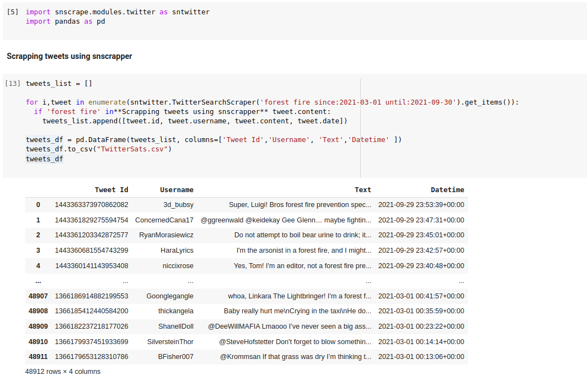
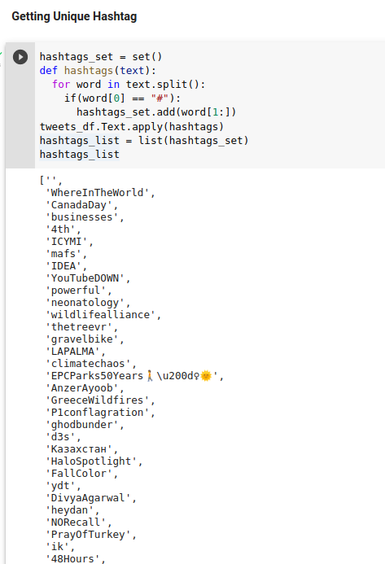
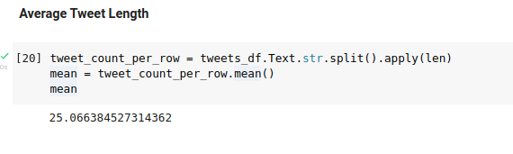

# Twitter SNScrapper API

Solution to an assignment given to me using Twitter public API.

* **Question 1**
  * Create a dataset (data frame in python) of tweets. [Hint: Write a script in python or java to download tweets using Twitter API SNScrapper. Tweets must contain the phrase “forest fire”. User id, Username, Tweet Text, Date, & Time for every tweet should be downloaded. The tweets should be posted from March 2021 to October 2021.]
  
  

* **Solution 1**

  

  * [csv_file](TwitterSats.csv)

* **Question 2**
  * Find a unique list of Hashtags used in the downloaded tweets. 

* **Solution 2**

  

  * [list](hashtags.txt)

* **Question 3**

  * Find the average length of tweets in words.

* **Solution 3**

  * 

